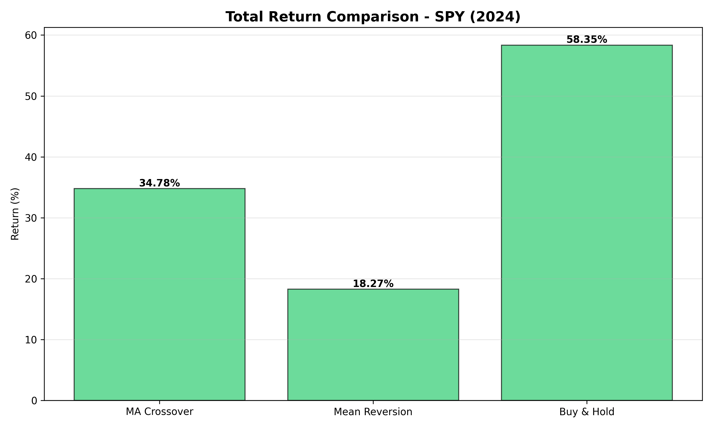
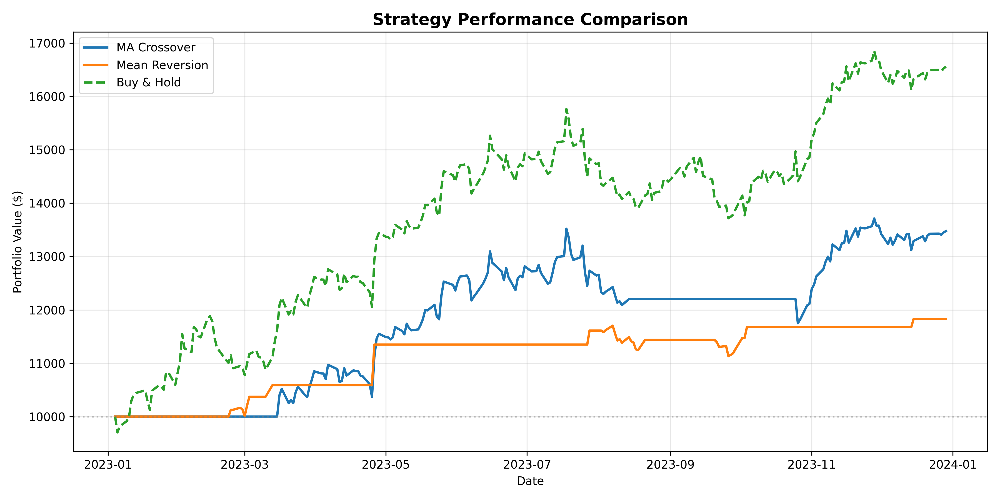
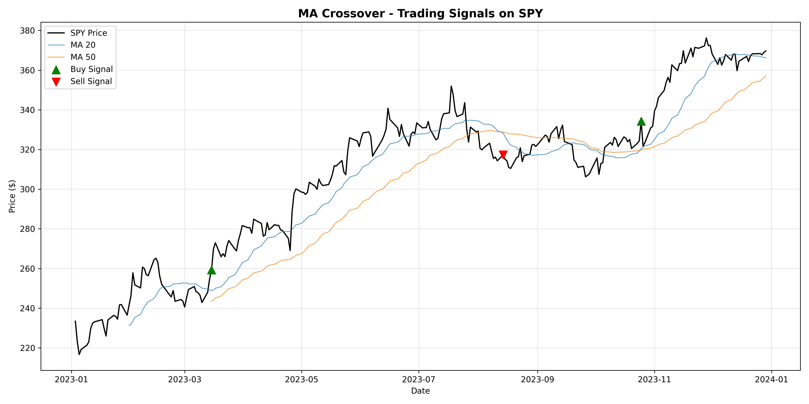

# Algorithmic Trading Backtester

A Python-based backtesting framework for testing algorithmic trading strategies on historical stock data. Supports multiple strategies, generates performance visualizations, and provides detailed trade analytics.

## Features

- **Multiple Trading Strategies**
  - Moving Average Crossover
  - Mean Reversion
  - Easily extensible for custom strategies

- **Comprehensive Analytics**
  - Total return percentage
  - Maximum drawdown
  - Trade-by-trade logging
  - Performance comparison vs buy-and-hold

- **Professional Visualizations**
  - Equity curves
  - Price charts with buy/sell signals
  - Strategy performance comparison

## Installation

```bash
# Clone the repository
git clone https://github.com/ari-cummins/algo_backtester.git
cd algo_backtester

# Install dependencies
pip install -r requirements.txt
```

## Usage

### Run backtest on default settings (SPY, both strategies)
```bash
python main.py
```

### Test a specific stock
```bash
python main.py --ticker AAPL
```

### Run a single strategy
```bash
python main.py --ticker NVDA --strategy ma
```

### Custom date range and capital
```bash
python main.py --ticker MSFT --start 2023-01-01 --end 2024-01-01 --capital 50000
```

### Command-line options
- `--ticker`: Stock symbol (default: SPY)
- `--start`: Start date YYYY-MM-DD (default: 2024-01-01)
- `--end`: End date YYYY-MM-DD (default: 2025-01-01)
- `--capital`: Initial capital in USD (default: 10000)
- `--strategy`: ma | mr | both (default: both)

## Example Output

### Performance Comparison


### Equity Curves


### Trading Signals


## Project Structure
algo_backtester/
├── data/              # Data loading utilities
├── strategies/        # Trading strategy implementations
├── engine/            # Backtesting engine
├── utils/             # Visualization and helper functions
├── main.py            # CLI entry point
└── requirements.txt   # Python dependencies

## Results Summary (SPY 2024)

| Strategy | Return | Max Drawdown | Trades |
|----------|--------|--------------|--------|
| MA Crossover | 6.39% | 8.36% | 5 |
| Mean Reversion | 3.09% | - | - |
| Buy & Hold | 25.59% | - | 0 |

**Key Insight:** Simple algorithmic strategies underperformed buy-and-hold during 2024's strong uptrend, highlighting the importance of market regime awareness in strategy selection.

## Technologies Used

- Python 3.12
- pandas (data manipulation)
- yfinance (market data)
- matplotlib (visualization)

## Future Enhancements

- [ ] Additional strategies (momentum, breakout)
- [ ] Risk management (stop-loss, position sizing)
- [ ] Multi-asset portfolio backtesting
- [ ] Walk-forward optimization
- [ ] Performance metrics (Sharpe ratio, Sortino ratio)

## License

MIT

## Author

Built by Ari Cummins as a portfolio project demonstrating Python proficiency, data analysis, and financial modeling.